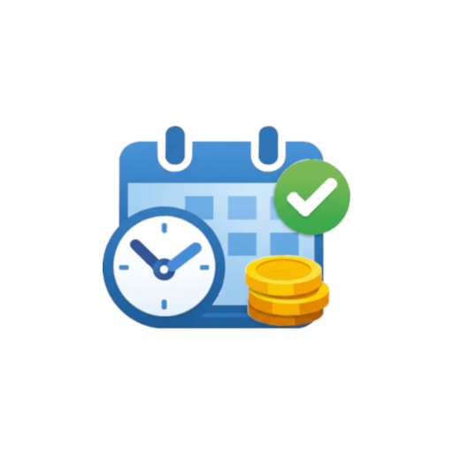
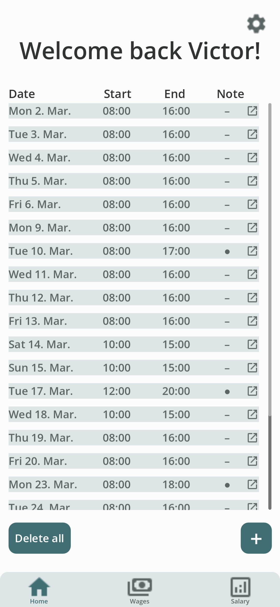
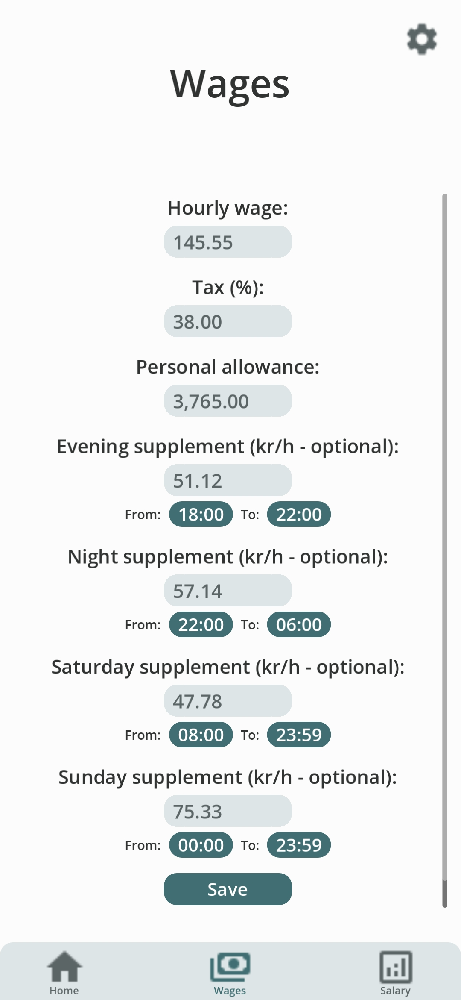
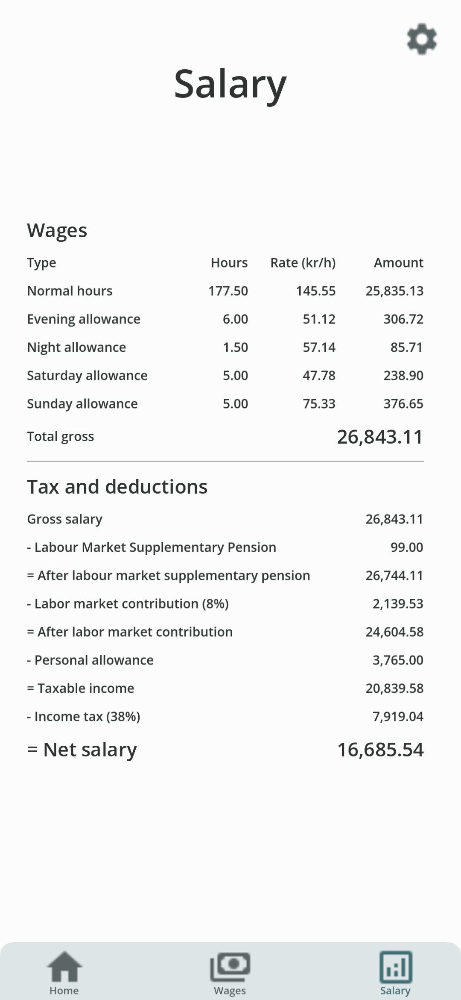
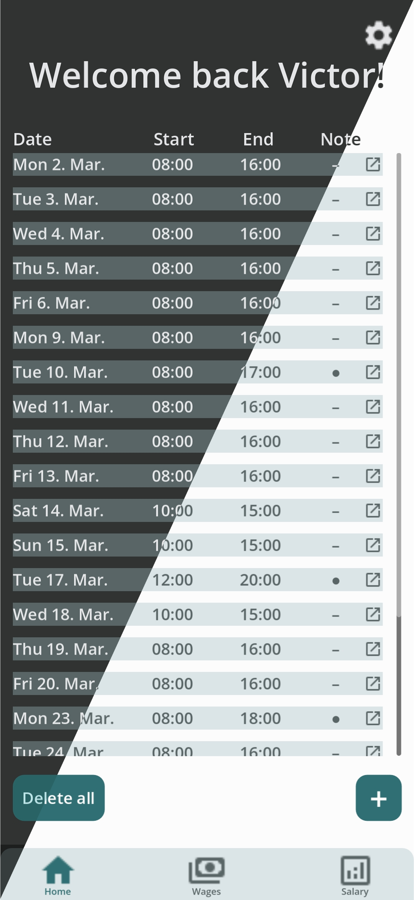

  

<h1 align="center">My Workingdays</h1>

  
  
  
  

  A simple app to track working hours and calculate expected salary, built with Godot and FastAPI.

  The app is designed for salary calculation in Denmark.

<h4 align="center">
  <a href="#-features">Features</a> •
  <a href="#screenshots">Screenshots</a> •
  <a href="#backend-authentication">Backend authentication</a> •
  <a href="#credits">Credits</a> •
  <a href="#license">License</a>
</h4>

## ✨ Features

- **📝 Work entry tracking**: Add, edit, and delete entries with date, start/end times, and optional notes
- **💰 Wage configuration**: Hourly wage, tax rate, personal allowance (fradrag), and optional evening/night/weekend supplements with custom time windows
- **📄 Danish payslip**: View salary breakdown with gross pay, Labour Market Supplementary Pension (ATP), labour market contribution (AM-bidrag), personal allowance (fradrag), income tax, and net salary
- **🌐 Multi-language support**: Choose your preferred language: English or Danish
- **🎨 Light and dark theme**: Switch between light and dark theme
- **📱 Offline-first**: All data is stored locally on your device

Danish terms explained

For users outside Denmark, here is a brief explanation of the Danish salary terms used in the app:

- **Labour Market Supplementary Pension (Arbejdsmarkedets Tillægspension / ATP)**: A mandatory pension contribution for Danish employees. More info: [ATP](https://www.atp.dk/en/).
- **Labour market contribution (Arbejdsmarkedsbidrag / AM-bidrag)**: A labour market contribution of 8% paid on gross salary before income tax. It funds unemployment benefits and labour market measures. More info: [SKAT – Labour market contribution](https://skat.dk/en-us/individuals/labour-market-contribution).
- **Personal allowance (fradrag / personfradrag)**: The tax-free amount you can earn before income tax applies. More info: [SKAT – Deductions and allowances](https://skat.dk/en-us/individuals/deductions-and-allowances).

## 📸 Screenshots

| Home | Wages |
|:---:|:---:|
|  |  |
| Salary | Themes |
|  |  |

### 🔐 Backend authentication

This app is built on the [Godot-FastAPI Auth Template](https://github.com/Vandreic/Godot-FastAPI-Auth-Template), which provides the backend authentication layer. The backend is fully set up but **bypassed by default** in code. User can bypass the backend authentication by pressing the "Reload" button on the login screen next to "Connection timed out".

To use real authentication, developers must remove the bypass `ScreenManager.change_screen(ScreenManager.Screen.NAME_ENTRY_SCREEN)` in [client/screens/login/login_screen_manager.gd](client/screens/login/login_screen_manager.gd) at the `_on_reconnect_button_pressed` function.

**To use the backend** (run your own server, configure keys, test on phone, etc.), see the [template repository](https://github.com/Vandreic/Godot-FastAPI-Auth-Template) for:
- Quick start and prerequisites
- Server configuration (`.env`, `GLOBAL_ACCESS_KEY`, `HOST`, `PORT`)
- Client configuration (`HOST_EDITOR`, `HOST_EXPORTED` in `api_manager.gd`)
- Phone testing

## 📱 Usage

Android

You can install My Workingdays by using [Obtainium](https://github.com/ImranR98/Obtainium/) for automatic updates, or manually if you prefer direct downloads.

Install with Obtainium

1. [Download](https://github.com/ImranR98/Obtainium/releases/latest) and install Obtainium.
2. Open Obtainium and tap `Add App` from the bottom tab bar.
3. Enter `MyWorkingdays-Godot` in the search field, tap `Search`, select `GitHub` as the source, and then tap `Select 1`.
4. Choose `Vandreic/MyWorkingdays-Godot` from the results and tap `Pick`.
5. At the top of the screen, next to the GitHub URL, tap the `Add` button to confirm.
6. At the bottom bar, tap `Install` to begin the installation.

Update through Obtainium

When new updates are released, My Workingdays can be updated via Obtainium.

1. Open Obtainium.
2. To update My Workingdays:
   * Tap the "update icon" (phone with downward arrow) next to `MyWorkingdays-Godot by Vandreic`.
    ***or*** 
   - Select `MyWorkingdays-Godot` from the app list and tap `Update` from the bottom bar.

**Note:** Obtainium supports automatic updates, allowing apps to be updated seamlessly in the background. This feature is enabled by default and ensures that My Workingdays stays up-to-date. For more details, visit the [Obtainium wiki](https://github.com/ImranR98/Obtainium/wiki#background-updates).

Manual Installation

1. [Download](https://github.com/Vandreic/MyWorkingdays-Godot/releases/latest) the latest release.
2. Install the app and run.

Manual Update

When new updates are released, you need to manually [download](https://github.com/Vandreic/MyWorkingdays-Godot/releases/latest) the latest release and install it over the existing installation. 
  
**Note:** If My Workingdays is installed via Obtainium, updates can be downloaded and installed automatically.

Windows

1. [Download](https://github.com/Vandreic/MyWorkingdays-Godot/releases/latest) the latest release.
2. Run the executable.

macOS / iOS / Linux

My Workingdays hasn't been compiled for macOS, iOS, or Linux, but you can compile the source code yourself if desired.

## 📜 Credits

| Asset | Source | License |
| :--- | :--- | :--- |
| **Country Flags** | [lipis/flag-icons](https://github.com/lipis/flag-icons) | MIT |
| **Icons** | [Google Material Icons](https://fonts.google.com/icons) | Apache 2.0 |

## 🔒 License
My Workingdays is released under the [GNU Affero General Public License v3.0 (AGPL-3.0-only)](LICENSE.md).
